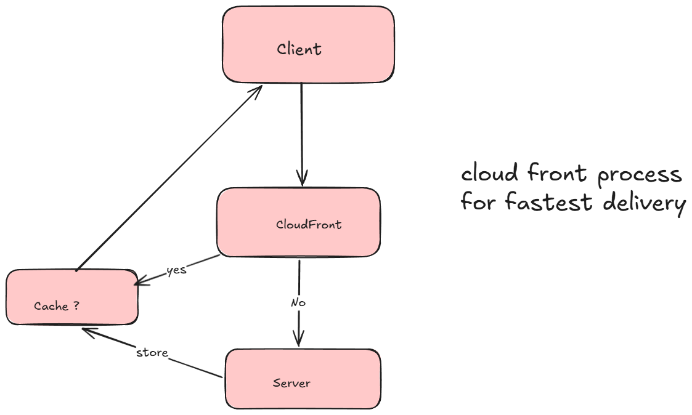
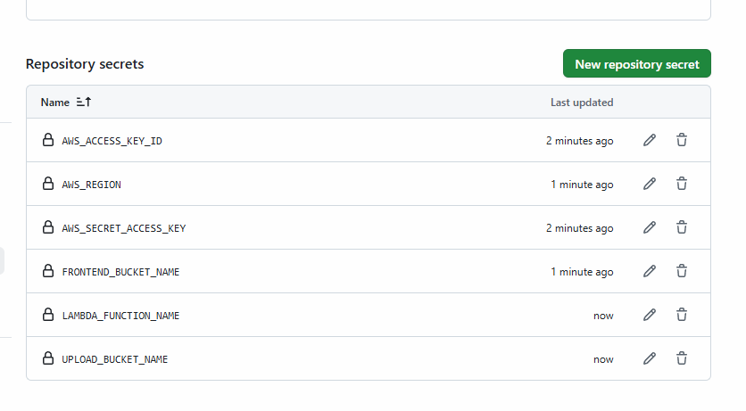

# Project Description for Implementation

- deploy frontend using CLoudfront + S3 Bucket
- when user upload pdf and submit form its uplopaded on s3 bucket
- need dynamodb table
- nedd one S3 bucket for Remote Backend

## How Many Buckets Required

- 1 bucket for Remote Backend  #thi we will create manually
- 1 bucket for frontend code upload
- 1 bucket for backend image upload

## CloudFront

- we are using cloudfront for static website hosting
- hosting we will do from s3 bucket and then deploy from cloudfront
- so it will provide one CDN link
- you can access website using that link



## Create Bucket for Remote Backend

```bash
aws s3api create-bucket \
--bucket devops-accelerator-platform-tf-state-sonam \
--region us-east-1
```

## Create DynamoDB Table for Locking

```bash
aws dynamodb create-table \
--table-name devops-accelerator-tf-locker \
--attribute-definitions AttributeName=LockID,AttributeType=S \
--key-schema AttributeName=LockID,KeyType=HASH \
--billing-mode PAY_PER_REQUEST \
--region us-east-1
```

## Creating zip file for lambda functions

```bash
cd backend/generate-presigned-url/
zip -r lambda.zip .

cd backend/process-uploaded-file/
zip -r lambda.zip .
```

## Creating pipelines for Backend Frontend and Terraform

- before that we need to setup some secrets in github Repository
- you can store then in Repository Secrets

- go to Repository: Settings
- Secrets and Variables: Actions

- click on Add Repository Secrets


- If you don't have access key and secret key
- IAM -> create user with policy attached (administrator access) -> create User
- once user created you can see option to generate Access Key
- click on that select CLI and generate. (make sure you download CSV file)